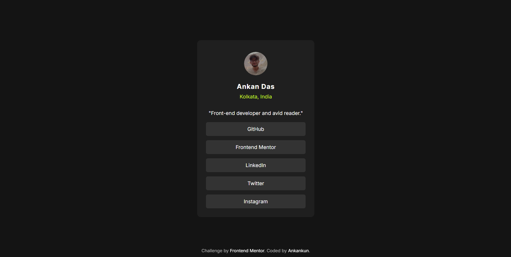

# Social links profile

This is my solution to the [Social links profile challenge](https://www.frontendmentor.io/challenges/social-links-profile-UG32l9m6dQ). A compact profile card with avatar, location, short bio, and a vertical list of social links featuring hover/focus states and accessible markup.

## Table of contents

- [Overview](#overview)
  - [The challenge](#the-challenge)
  - [Links](#links)
- [My process](#my-process)
  - [Built with](#built-with)
  - [What I learned](#what-i-learned)
  - [Continued development](#continued-development)
  - [Useful resources](#useful-resources)
- [Author](#author)

## Overview

### The challenge

Users should be able to:

- See hover and keyboard focus states on all interactive links
- View the component comfortably on mobile and desktop viewports

### Links

- Solution URL: https://www.frontendmentor.io/solutions/social-links-profile-using-css-flex-9m0i0kN53n/

- Live Site URL: https://ankankun.github.io/Social-Links-Profile/

## My process

### Built with

- Semantic HTML5
- Modern CSS (flexbox, custom font, hover/focus states)
- Mobile-first thinking (single-column layout)
- Minimal footprint: no frameworks

### What I learned

- Using a single flex column container with centered alignment keeps the card layout simple while allowing an independently positioned footer.
- Replacing large top margins with layout techniques (flex centering or fixed positioning for attribution) creates true vertical centering.
- Explicit `:focus-visible` states greatly improve keyboard accessibility for link groups.

### Continued development

- Add prefers-reduced-motion handling for any future animations.
- Introduce CSS variables for color tokens and spacing scale.
- Add a dark/light toggle or theme expansion.

### Useful resources

- MDN: [Flexbox guide](https://developer.mozilla.org/en-US/docs/Web/CSS/flex)
- MDN: [:focus-visible](https://developer.mozilla.org/en-US/docs/Web/CSS/:focus-visible)
- GitHub Docs: [GitHub Pages deployment](https://docs.github.com/en/pages)

## Author

- GitHub: [@Ankankun](https://github.com/Ankankun)
- Frontend Mentor: [@Ankankun](https://www.frontendmentor.io/profile/Ankankun)
